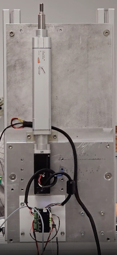

# Ankle setup
The setup was created to do some test for the ErgoCub 2.0 Ankle Design project. It utilizes a Camozzi linear actuator, shown in the image below.  

| Motor  	| Electronic boards 	|
|--------	|-------------------	|
| `MECAPION APM SA01ACN-8` [Datasheet](http://wingst-icub.iit.local/direct_download.php?LINK=%2F%2Fiiticubstor01.iit.local%2Ficub-tech%2Fmechatronics%2FDatasheet%2FMotors%2FMecapion%2FMecapion+servo+motors+2012.pdf) 🔒 | `2FOC` [Documentation](https://github.com/icub-tech-iit/electronics-boards/tree/master/2foc/docs) |
|| `EMS4` [Documentation](https://github.com/icub-tech-iit/electronics-boards/tree/master/ems4/docs)              	|  

The motor datasheet includes integrated encoder specifications.
