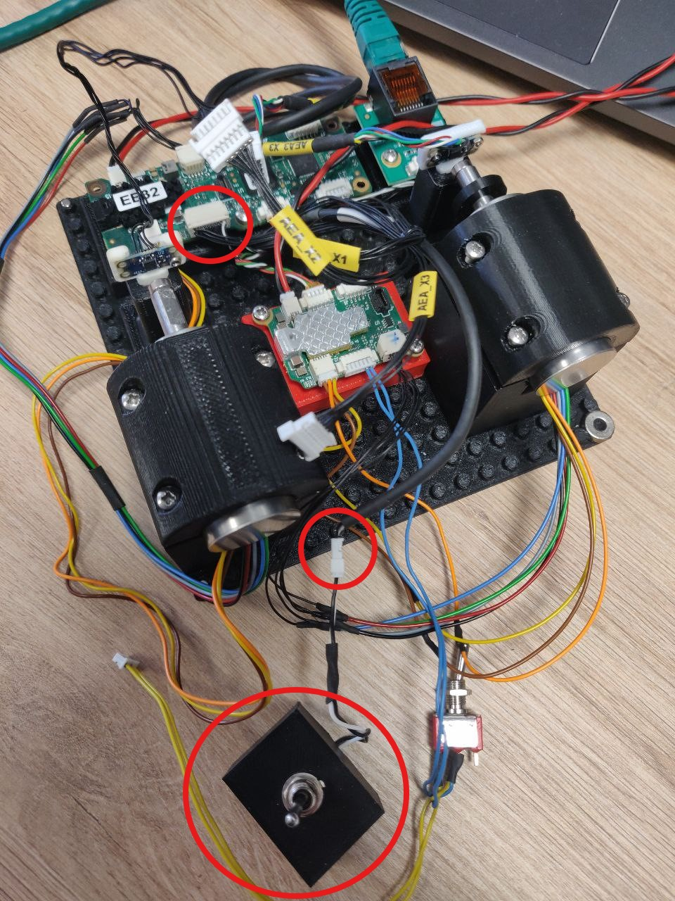

# Readme

This lego setup is built to command two motors using `yarprobotinterface` and `yarpmotorgui`.   
One motor is controlled by an `amc` board and the other by an `amcbldc` board.

# Electronic configuration

## `Amcbldc`
The first joint, the one linked to the `amcbldc` has the encoder `aea3` connected to the connector `J5_X1` and the motor linked to the board itself.    
The `amcbldc` is connected to the `amc` on `CAN1:1`.
The fault button is connected to the baord as shown in the image below.

## `Amc`
The second joint is linked to the `amc` and has the encoder on the connector `J5_X2`.   
The `amc` is also connected via ethernet to the PC.
The fault button is connected to the baord using the `J5` connector.

# Mechanichal configuration
This setup works with motors that have a `Gearbox_M2J` of 196.

# Files configuration
All the parameters cited above can be changed in the configuration files.   
This setup is configured to be used with `yarprobotinterface` and `yarpmotorgui`.

# Assets 
You can see pictures in `assets` for additional help to build the setup.

**Figure 1** Setup view.

## `Amc`

**Figure 2** Cable connection for `aea3` of the `amc`.

**Figure 3** Cable connection for the motor of the `amc`.

**Figure 4** Cable connection for the fault of the `amc`.

## `Amcbldc`

**Figure 5** Cable connection for `aea3` of the `amcbldc`.

**Figure 6** Cable connection for the fault of the `amcbldc`.