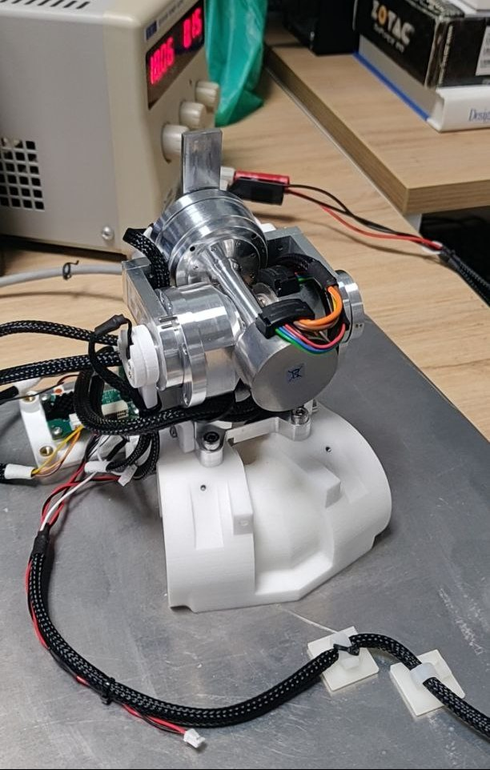

2 Joints Neck Setup
===================
This setup is a prototype of the neck that will be mounted on `iCub` and `ergoCub`.          
It comprehends two motors and it can be moved using `yarprobotinterface` and `yarpmotorgui`.   
One motor is controlled by an `amc` board and the other by an `amcbldc` board.
All the parameters to move the setup are in the configuration files.   

### Photo of the setup 

|  |
| :---: |
|  |
| **Figure 1** Setup view |
 
