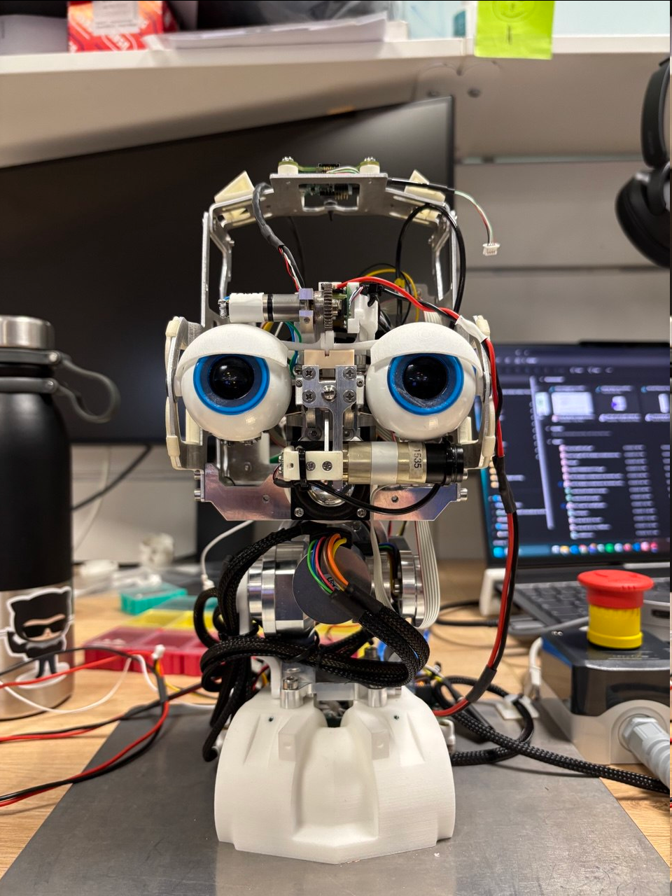
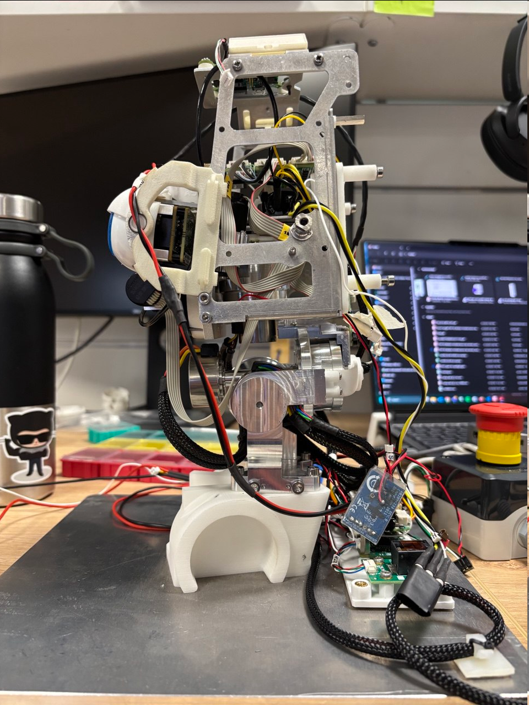

3 Joints Neck Setup
===================

This is the setup the neck MK3 that will be mounted on `iCub` and `ergoCub`.          
It consists of three motors and can be actuated using `yarprobotinterface` and `yarpmotorgui`.   
One motor is controlled by an `amc` board and the others by two `amcbldc` boards.          
All the parameters to move the setup are in the configuration files.            

These configuration files are still a work in progress

### Picture of the setup 

|  |
| :---: |
|  |
| **Figure 1** Setup front view |
|  |
| **Figure 2** Setup side view |
 
